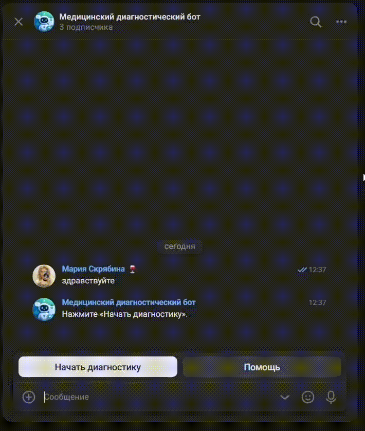

# Medical Diagnosis Chatbot

[](https://github.com/luba-l/coursework_chatbot/actions/workflows/ci.yml)
[](LICENSE)

Чат-бот для первичной диагностики заболеваний на основе текстового описания симптомов с использованием методов машинного обучения. Пользователь описывает свои симптомы в сообщении, бот анализирует текст и выдаёт три наиболее вероятных диагноза. Реализован через ВКонтакте.

## Оглавление

- [Medical Diagnosis Chatbot](#medical-diagnosis-chatbot)
  - [Оглавление](#оглавление)
  - [Демонстрация работы](#демонстрация-работы)
  - [Рекомендованные требования](#рекомендованные-требования)
  - [Технологический стек](#технологический-стек)
  - [Описание](#описание)
    - [Возможности чат-бота](#возможности-чат-бота)
  - [Архитектура проекта](#архитектура-проекта)
  - [Структура модулей](#структура-модулей)
    - [Модуль предобработки данных](#модуль-предобработки-данных)
    - [Модуль машинного обучения](#модуль-машинного-обучения)
    - [Модуль чат-бота](#модуль-чат-бота)
  - [Установка](#установка)
    - [Для пользователя](#для-пользователя)
    - [Для разработчика](#для-разработчика)
  - [Модели машинного обучения](#модели-машинного-обучения)
  - [Авторы проекта](#авторы-проекта)
  - [Лицензия](#лицензия)

## Демонстрация работы



## Рекомендованные требования

- **Python:** 3.9+
- **spaCy:** 3.0+
- **Модель spaCy:** ru_core_news_sm
- **ОС:** Windows 10+ / Linux / macOS

## Технологический стек

| Технология | Назначение |
|------------|------------|
| Python 3.9+ | Основной язык разработки |
| scikit-learn | Модели машинного обучения |
| spaCy | Лемматизация текста |
| TF-IDF | Векторизация текстов |
| XGBoost | Ансамблевый метод |
| vk_api | Интеграция с ВКонтакте |
| pandas, numpy | Обработка данных |
| matplotlib, seaborn | Визуализация результатов |
| joblib | Сохранение и загрузка моделей |
| pytest | Тестирование |
| flake8 | Проверка стиля кода |
| GitHub CI | Автоматическое тестирование и линтинг |

## Описание

### Возможности чат-бота

- приём текстового описания симптомов от пользователя;
- предобработка текста: очистка и лемматизация через spaCy;
- классификация симптомов обученной моделью LinearSVC;
- выдача трёх наиболее вероятных диагнозов;
- работа через сообщения сообщества ВКонтакте.

## Архитектура проекта

Проект разделён на три основные подсистемы, разработанные независимо:

```
Пользователь ВКонтакте
        │
        ▼
   Чат-бот (vk_api)
        │
        ▼
  Предобработка текста ──── TF-IDF векторизатор ──── ML-модель
        │
        ▼
  Топ-3 диагнозов пользователю
```

Данные для обучения проходят отдельный пайплайн: сбор, очистка, лемматизация, объединение в финальный датасет.

[🔝 Оглавление](#оглавление)

## Структура модулей

### Модуль предобработки данных

Основные скрипты в `scripts/`:

- `clean_selected.py` — очистка текста от шума;
- `lemmatize_selected.py` — лемматизация через spaCy;
- `merge_final.py` — объединение в финальный датасет;
- `eda_final_dataset.py` — разведочный анализ.

Функциональность:

- загрузка сырых датасетов;
- очистка и лемматизация текстов;
- формирование обучающей выборки.

### Модуль машинного обучения

Основные скрипты в `ml_models/`:

- `train.py` — обучение пяти моделей;
- `real_test.py` — проверка на реальных текстах;
- `select_model.py` — выбор лучшей модели и сохранение;
- `visualization.ipynb` — графики и визуализация.

Функциональность:

- TF-IDF векторизация;
- обучение LogisticRegression, LinearSVC, MultinomialNB, MLPClassifier, XGBoost;
- кросс-валидация (StratifiedKFold, 5 фолдов);
- расчёт метрик: Balanced Accuracy, Precision, Recall, F1-score;
- проверка на пользовательских примерах;
- сохранение модели и векторизатора.

### Модуль чат-бота

Основной скрипт в `src/`:

- `vk_bot.py` — чат-бот ВКонтакте.

Функциональность:

- приём и обработка сообщений;
- очистка текста через `clean_text`;
- лемматизация через `lemmatize_text` (spaCy);
- векторизация через TF-IDF;
- вызов модели и формирование ответа.

[🔝 Оглавление](#оглавление)

## Установка

### Для пользователя

```bash
git clone https://github.com/luba-l/coursework_chatbot.git
cd coursework_chatbot
pip install -r requirements.txt
python -m spacy download ru_core_news_sm
```

Создайте сообщество ВКонтакте, получите токен и укажите его в файле `.env`:

```
VK_TOKEN=ваш_токен
```

Запустите бота:

```bash
python src/vk_bot.py
```

### Для разработчика

Если вы хотите участвовать в разработке проекта:

1. Создайте fork репозитория.
2. Создайте отдельную ветку:

```bash
git checkout -b feature/your-feature
```

3. Внесите изменения.
4. Проведите тестирование:

```bash
pytest tests/
```

5. Проверьте стиль кода:

```bash
flake8 src/ ml_models/ scripts/ --max-line-length=120 --extend-ignore=E501,W503,E402,E741
```

6. Создайте Pull Request.

[🔝 Оглавление](#оглавление)

## Модели машинного обучения

Обучены и сравнены пять моделей:

| Модель | Тип |
|--------|-----|
| LogisticRegression | Линейная |
| LinearSVC | Линейная |
| MultinomialNB | Вероятностная |
| MLPClassifier | Нейронная сеть |
| XGBoost | Ансамблевая |

Для каждой модели рассчитаны метрики на обучающей и тестовой выборках, проведена кросс-валидация (5 фолдов) и проверка на реальных пользовательских текстах. Лучший результат показала LinearSVC (CV Mean: 0.9517). Модель и TF-IDF векторизатор сохранены в `models/`.

## Авторы проекта

**Скрябина Мария** — сбор и предобработка данных:
- поиск и объединение датасетов;
- очистка и лемматизация текстов;
- разведочный анализ данных;
- формирование финального датасета.

**Левина Любовь** — обучение и сравнение ML-моделей:
- TF-IDF векторизация;
- обучение пяти моделей;
- кросс-валидация и расчёт метрик;
- проверка на реальных текстах;
- выбор и сохранение лучшей модели.

**Швец Алина** — разработка чат-бота ВКонтакте:
- интеграция с VK API;
- сценарий диалога;
- подключение модели и векторизатора;
- тестирование бота.

## Лицензия

Medical Diagnosis Chatbot распространяется по лицензии MIT. См. файл [LICENSE](LICENSE).